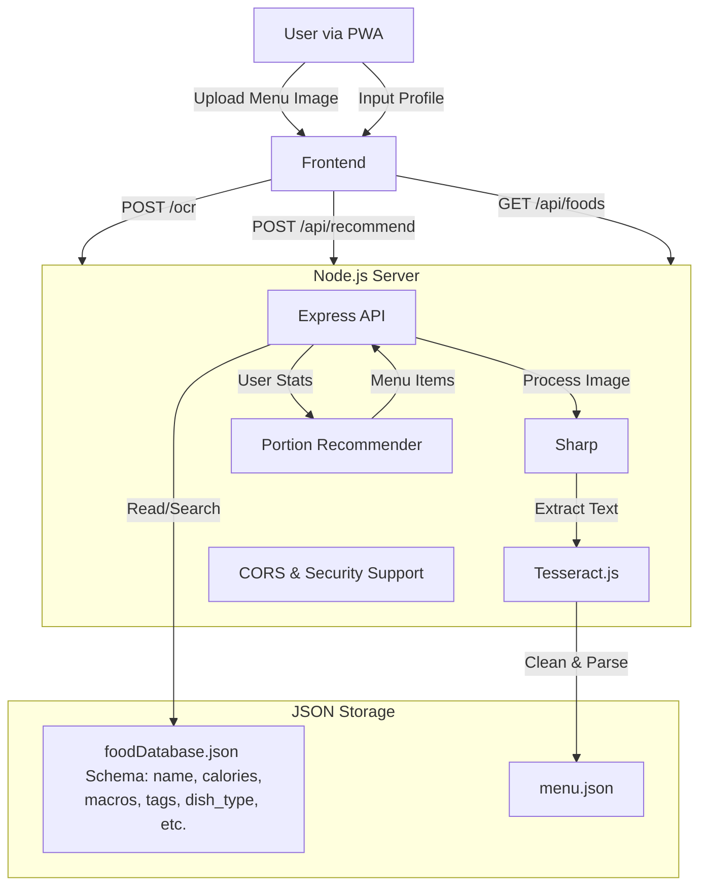

# PortionVision Technical Documentation

## 1. Project Overview
PortionVision is a Progressive Web App (PWA) designed to help users track their dietary intake in a hostel mess setting. It uses OCR to digitize daily menus and provides portion recommendations based on user profiles.

## 2. Technology Stack

### Frontend
- **Framework**: React 19 (Vite 7)
- **Styling**: Tailwind CSS 3.4
- **State Management**: React Context API (`AppContext`) + LocalStorage
- **Routing**: React Router DOM 7
- **PWA**: `vite-plugin-pwa` for offline capabilities and installability

### Backend
- **Runtime**: Node.js
- **Framework**: Express.js 5
- **Image Processing**: 
  - `sharp`: Pre-processing (grayscale, thresholding, resizing, sharpening)
  - `tesseract.js` v6: Optical Character Recognition (OCR)
- **File Uploads**: `multer` (with file type and size validation)
- **Data Storage**: JSON flat files (`data/foodDatabase.json`, `data/menu.json`)

## 3. Architecture



## 4. Key Workflows

### 4.1 Menu Digitization
1.  **User Action**: Uploads an image of the mess menu via `MenuUpload` page.
2.  **Frontend**: Validates image and sends to `POST /ocr`.
3.  **Backend**:
    *   **Preprocessing**: `Sharp` converts image to grayscale, normalizes, thresholds (160), and sharpens it.
    *   **OCR**: `Tesseract.js` extracts raw text.
    *   **Cleanup**: `cleanMenuItems` function filters noise, removes common headers (Breakfast, Lunch), splits text by commas/slashes, and dedupes.
    *   **Storage**: Saves result to `data/menu.json`.
    *   **Database Update**: Automatically adds new unique menu items to `data/foodDatabase.json` with a default schema (initialized to 0/empty values) for future enrichment.
4.  **Frontend**: Updates `AppContext` and displays the digitized menu.

### 4.2 Portion Recommendation
1.  **User Profile**: User's height, weight, age, sex, and activity level are collected on `Preferences` page and stored in `localStorage`.
2.  **Request**: Frontend sends user profile + current menu to `/api/recommend`.
3.  **Backend Logic**:
    *   Calculates BMR (Mifflin-St Jeor) and TDEE.
    *   Allocates calories per meal (Breakfast: 25%, Lunch: 35%, Dinner: 30%, Snack: 10%).
    *   Matches menu items against `foodDatabase.json` (or generic fallbacks).
    *   Calculates precise gram/bowl portion sizes to meet the specific meal's caloric target.

## 5. API Endpoints

### `POST /ocr`
-   **Description**: Uploads and processes a menu image.
-   **Body**: `multipart/form-data` with `image` file.
-   **Processing**: Resize (width 1200px) -> Grayscale -> Threshold -> OCR -> Regex Clean.
-   **Response**: `{ "menuItems": ["Item 1", "Item 2", ...] }`

### `POST /api/recommend`
-   **Description**: Generates portion advice.
-   **Body**: `{ "userProfile": { weight, height, age, gender, activityLevel, goalType }, "mealType": "lunch" }`
-   **Response**: JSON object with calculated portions for each menu item.

### `GET /api/foods`
-   **Description**: Retrieves the entire food database.
-   **Response**: JSON array of food objects.

### `GET /api/foods/search`
-   **Query Param**: `q` (search term).
-   **Description**: Fuzzy searches for foods by name.
-   **Response**: JSON array of matching food objects.

### `GET /health`
-   **Description**: Health check.
-   **Response**: `{ status: 'healthy', timestamp: ... }`

## 6. Directory Structure
```
portion-vision/
├── backend/
│   ├── data/                 # JSON storage (menu.json, foodDatabase.json)
│   ├── uploads/              # Temp upload storage for OCR
│   ├── server.js             # Main Express App & API Routes
│   └── portion_recommender.js # TDEE & Portion Logic
├── frontend/
│   ├── src/
│   │   ├── components/       # UI Components (ErrorBoundary, etc.)
│   │   ├── contexts/         # AppContext (Global State)
│   │   ├── pages/            # Views (Home, Splash, Upload, Plate, Analysis)
│   │   ├── services/         # API Service functions
│   │   └── App.jsx           # Routing & Layout
│   └── public/               # PWA Manifest & Assets
```

## 7. Current Implementation Status

### ✅ Implemented & Working
1.  **Full Menu Pipeline**: Image upload -> Server-side processing -> OCR -> UI display.
2.  **Personalized Engine**: User stats -> Backend Recommender -> Personalized Grams/Bowls.
3.  **Food Database**: Searchable JSON database integration.
4.  **Modern UI**: React 19 + Tailwind CSS with responsive PWA design.
5.  **Security**: Basic CORS, Helmet-style headers, Input validation (Multer).

### 🚧 Pending / Future Work
1.  **Plate Analysis**: `PlateCapture.jsx` exists but needs backend connection for food recognition on the plate.
2.  **Detailed Analysis**: Post-meal nutrition breakdown on `Analysis.jsx`.
