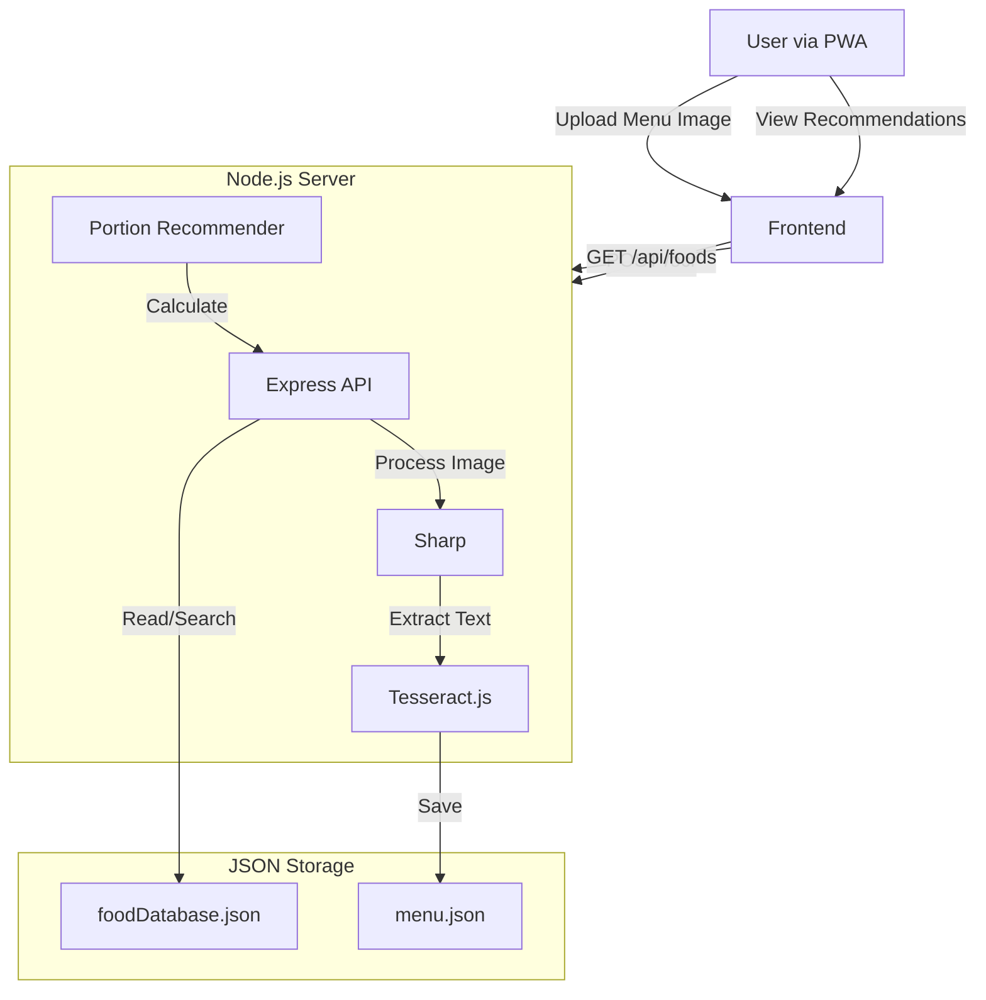

# PortionVision Technical Documentation

## 1. Project Overview
PortionVision is a Progressive Web App (PWA) designed to help users track their dietary intake in a hostel mess setting. It uses OCR to digitize daily menus and provides portion recommendations based on user profiles.

## 2. Technology Stack

### Frontend
- **Framework**: React (Vite)
- **Styling**: Tailwind CSS
- **State Management**: React Context API (`AppContext`) + LocalStorage
- **Routing**: React Router DOM

### Backend
- **Runtime**: Node.js
- **Framework**: Express.js
- **Image Processing**: Sharp (preprocessing), Tesseract.js (OCR)
- **File Uploads**: Multer
- **Data Storage**: JSON files (`data/foodDatabase.json`, `data/menu.json`)

## 3. Architecture



## 4. Key Workflows

### 4.1 Menu Digitization
1.  **User Action**: Uploads an image of the mess menu via specific page.
2.  **Frontend**: Validates image and sends to `POST /ocr`.
3.  **Backend**:
    *   **Preprocessing**: `Sharp` converts image to grayscale, normalizes, and thresholds it to improve OCR accuracy.
    *   **OCR**: `Tesseract.js` extracts raw text.
    *   **Cleanup**: `cleanMenuItems` function filters noise, removes common headers (Breakfast, Lunch), and splits text into individual items using Regex.
    *   **Storage**: Saves result to `data/menu.json`.
4.  **Frontend**: Updates `AppContext` and displays the digitized menu.

### 4.2 Portion Recommendation (Logic)
*   **User Profile**: User's height, weight, age, sex, and activity level are stored in `localStorage`.
*   **Calorie Estimation**: Uses the Mifflin-St Jeor equation to calculate Basal Metabolic Rate (BMR) and Total Daily Energy Expenditure (TDEE).
*   **Portion Calculation**: 
    - Allocates calories per meal (Breakfast: 25%, Lunch: 35%, Dinner: 30%, Snack: 10%).
    - Calculates recommended grams for a specific food item to meet that meal's calorie target.

## 5. API Endpoints

### `POST /ocr`
-   **Description**: Uploads an image for text extraction.
-   **Body**: `FormData` with `image` file.
-   **Response**: JSON with `menuItems` (array of strings).

### `GET /api/foods`
-   **Description**: Retrieves the entire food database.
-   **Response**: JSON array of food objects.

### `GET /api/foods/search`
-   **Query Param**: `q` (search term).
-   **Description**: Fuzzy searches for foods by name.
-   **Response**: JSON array of matching food objects.

### `GET /health`
-   **Description**: Health check for usage by monitoring tools.
-   **Response**: `{ status: 'healthy', timestamp: ... }`

## 6. Directory Structure
```
portion-vision/
├── backend/
│   ├── data/                 # JSON storage
│   ├── uploads/              # Temp upload storage
│   ├── server.js             # Main entry point
│   └── portion_recommender.js # Calc logic
├── frontend/
│   ├── src/
│   │   ├── components/       # Reusable UI
│   │   ├── contexts/         # Global state
│   │   ├── pages/            # Route views
│   │   └── services/         # API wrapper
│   └── public/               # Static assets
```

## 7. Current Implementation Status & Gaps

### ✅ Implemented & Working
1.  **Menu Digitization**: Full pipeline from Image -> OCR -> JSON Menu.
2.  **Food Database**:
    -   Comprehensive JSON database with nutritional info.
    -   API endpoints for listing and searching foods.
3.  **Frontend Core**:
    -   Routing, AppContext, and basic UI shell.
    -   Menu Upload and Plate Capture (Camera/Gallery) pages.

### 🚧 Pending / In Progress
1.  **Portion Recommendation Engine**:
    -   Logic exists in `portion_recommender.js` but is **disconnected** from the API.
    -   No API endpoint exists to generate meal plans (e.g., `POST /api/recommend`).
2.  **Analysis Page**:
    -   Currently a UI placeholder.
    -   Does not yet receive or display analysis data from the backend.
3.  **Home Page Integration**:
    -   "Recommended Portions" card is a static placeholder.
    -   Needs to fetch data from the recommendation engine.

### Next Steps
1.  Create `POST /api/recommend` endpoint in `server.js` using `portion_recommender.js`.
2.  Connect Frontend `Home` and `Analysis` pages to this new endpoint.
3.  Implement real-time analysis for captured plate photos.

